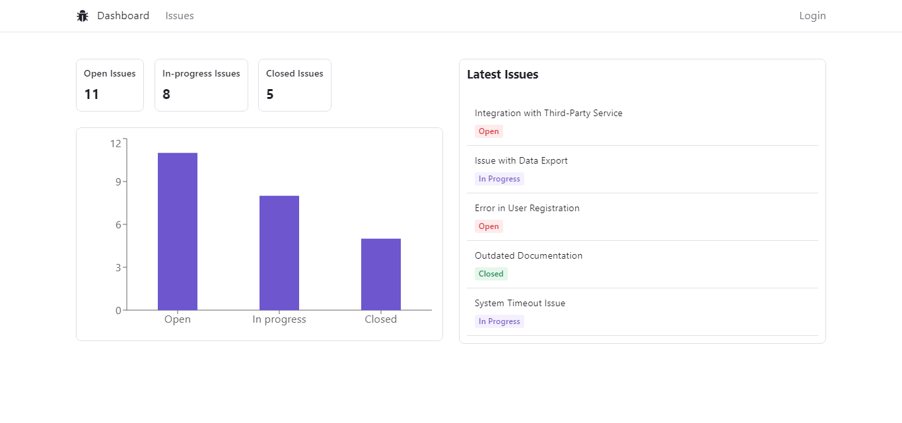

# Issue Tracker - A Nextjs Application.

## Table of contents

- [Overview](#overview)
  - [Screenshot](#screenshot)
  - [Links](#links)
- [My process](#my-process)
  - [Built with](#built-with)
  - [Useful resources](#useful-resources)
- [Get Started](#get-started)
- [Author](#author)

## Overview

### Screenshot

### Links

- Live Site URL: [Issue Tracker](https://nextjs-issuetracker.vercel.app/)

## My process

### Built with

- [Next.js](https://nextjs.org/)
- [NextAuth.js](https://next-auth.js.org/)
- [TypeScript](https://www.typescriptlang.org/)
- [Radix UI](https://www.radix-ui.com/)
- [Tailwind CSS](https://tailwindcss.com/)
- [Prisma](https://www.prisma.io/)
- [Zod](https://zod.dev/)
- [React Hook Form](https://react-hook-form.com/)

### Useful resources

- [CockroachDB Database Setup and Usage Guide](https://www.youtube.com/playlist?list=PLXswBSp5YNOtm2XvxiPRUCXFT2bUNecXP)

## Get started

- To get started, follow these steps:

1. Clone this repository to your local machine. 
2. In the project folder, rename **.env.example** to **.env** (no period after). 
3. Set **all** the environment variables according to the instructions in the file. If you don't set them properly, the application will not work.
4. Run `npm install` to install the dependencies.
5. Run `npx prisma migrate dev` to generate your database tables.
6. Run `npm run dev` to start the web server. 

## Author

- Portfolio - [Shaher Ashraf](https://thegoat7.netlify.app/)
- LinkedIn - [Shaher Ashraf](https://www.linkedin.com/in/shaher88223/)
